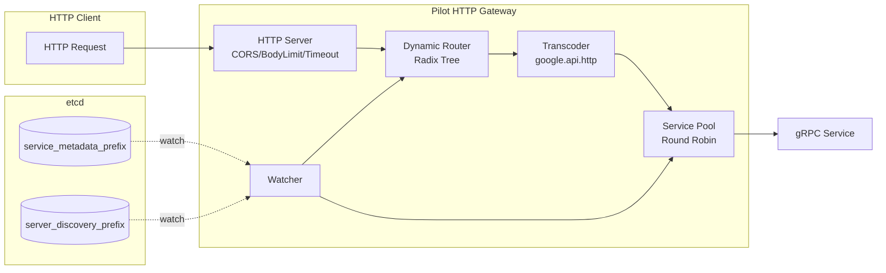

# Pilot HTTP Gateway ✨

> 一个优雅、轻量、可容器化部署的 gRPC ↔ HTTP 动态网关

<p align="left">
  
  
  
  
</p>

- 动态发现：基于 etcd 自动发现服务元数据与实例
- 自动路由：解析 google.api.http 注解，动态生成 REST 路由
- 无缝转发：HTTP → gRPC 调用，统一 JSON 响应格式
- 稳健内核：负载均衡、错误码映射、CORS、超时与大小限制、优雅停机

---

## 目录
- [特性亮点](#特性亮点)
- [架构总览](#架构总览)
- [项目结构](#项目结构)
- [快速开始](#快速开始)
- [配置说明](#配置说明)
- [etcd 注册约定](#etcd-注册约定)
- [路由与转发规则](#路由与转发规则)
- [CORS 与安全](#cors-与安全)
- [使用示例](#使用示例)
- [常见问题](#常见问题)
- [故障排查](#故障排查)
- [依赖与兼容](#依赖与兼容)
- [许可证](#许可证)

---

## 特性亮点
- ⚡ 动态：监听两个前缀（metadata / discovery），自动感知服务变化
- 🧭 自适应路由：按注解生成 GET/POST/PUT/PATCH/DELETE 与自定义方法
- 🔁 负载均衡：实例池轮询选择，自动关闭下线实例连接
- 🧱 鲁棒：错误码 gRPC→HTTP 映射、请求体限流、读写超时、Header 过滤
- 🧩 无侵入：仅依赖注解和 etcd 注册内容，无额外侵入业务代码
- 🧽 优雅停机：Shutdown + 监听器关闭 + 资源清理
- 📦 即插即用：Dockerfile / docker-compose 现成可用

---

## 架构总览


> 注：路由键内部标准化为 /[METHOD]/cleanedPath 以消除重复与异常分隔符

---

## 项目结构
- cmd/pilot/main.go：入口，加载配置并启动/停止网关
- internal/gateway/httpgateway.go：HTTP 服务、中间件（CORS/BodyLimit）、超时与优雅关闭
- internal/discovery/
  - types.go：服务/实例/事件类型
  - watcher.go：全量加载 + watch，发出 Add/Update/Delete 事件
- internal/router/
  - routertree.go：并发安全 Radix 路由树（静态/参数/通配符）
  - router.go：按 protobuf 描述符注册/注销 HTTP 路由，维护服务实例池
  - serverhttp.go：路由匹配、请求构造、调用 gRPC、错误映射、统一输出
  - servicepool.go：实例池与轮询选择
- internal/transcoder/
  - httprule.go：解析 google.api.http 注解
  - grpcinvoker.go：构建 gRPC 连接与描述符源、发起调用
  - grpchandler.go：调用事件与 JSON 序列化
- config/config.yaml：配置示例
- Dockerfile、docker-compose.yaml：容器化支持

---

## 快速开始
> 预置条件：可访问的 etcd（v3），并按下文约定写入 metadata 与 discovery

- 本地运行（Windows PowerShell 示例）
```powershell
# 在项目根目录
go run ./cmd/pilot
```

- Docker 运行
```bash
# 构建镜像
docker build -t pilot:latest .

# 以 compose 启动（需要 external 网络 pilot-gateway，或自行调整）
docker compose up -d
```
默认监听端口：8080

---

## 配置说明
示例（config/config.yaml）

```yaml
http:
  addr: ":8080"              # 监听地址
  read_timeout: 30s          # 读超时（默认 10s）
  write_timeout: 30s         # 写超时（默认 10s）
  max_header_bytes: 5142880  # Header 上限（默认 1MB）
  # max_body_bytes: 10485760 # Body 上限（默认 10MB）

etcd:
  endpoints:
    - "host.docker.internal:2379"
  dial_timeout: 5s
  service_metadata_prefix: "sample/metadata/"
  server_discovery_prefix: "sample/discover/"
```

默认值（internal/gateway/httpgateway.go）：
- ReadTimeout / WriteTimeout：10s
- MaxHeaderBytes：1<<20（约 1MB）
- MaxBodyBytes：10<<20（约 10MB）

---

## etcd 注册约定
| 类型 | Key 模板 | Value 结构 |
| --- | --- | --- |
| 元数据 | {service_metadata_prefix}{service_name} | JSON：service_name、descriptor_data(base64，protobuf FileDescriptorSet)、version、metadata |
| 实例 | {server_discovery_prefix}{service_name}/{instance_id} | 字符串："host:port" |

事件语义：
- Add：初次加载完成后每个服务一次，或首次见到新服务
- Update：元数据或实例集发生变化
- Delete：元数据删除且无存活实例，或实例集从有到无

---

## 路由与转发规则
- 路由来源：proto 方法注解 option (google.api.http)
- 支持方法：GET/POST/PUT/PATCH/DELETE/Custom
- 内部路由键：/[METHOD]/cleanedPath（规范化 path.Clean，去重多余分隔符）
- 请求负载构造：
  - Path 参数、Query 参数自动写入顶层 JSON
  - body="*"：Body 平展合并到顶层，覆盖同名键
  - body="field"：Body 作为指定字段注入
- Header → gRPC Metadata：过滤 hop-by-hop 与敏感头（如 connection、content-length 等）
- 统一响应：
  - 成功：{"code":0,"msg":"success","data":any}
  - 未匹配：HTTP 404 + 说明
  - gRPC 错误：按 codes 映射为 HTTP 状态码

---

## CORS 与安全
> 默认启用 CORS：
- Access-Control-Allow-Origin：有 Origin 时回显，无 Origin 时 "*"
- Access-Control-Allow-Credentials：true
- Access-Control-Allow-Methods：GET,POST,PUT,PATCH,DELETE,OPTIONS
- Access-Control-Allow-Headers：尊重 Access-Control-Request-Headers 或采用常用白名单
- 预检：OPTIONS 返回 204，缓存 600s

安全与限流：
- 请求体 MaxBytesReader 限制（MaxBodyBytes）
- http.Server 级 Read/Write Timeout 与 MaxHeaderBytes

---

## 使用示例
假设 proto 注解：
- rpc GetUser(GetUserRequest) returns (User) { option (google.api.http) = { get: "/v1/users/{id}" }; }
- rpc CreateUser(CreateUserRequest) returns (User) { option (google.api.http) = { post: "/v1/users" body: "*" }; }

请求：
```bash
# GET（路径参数）
curl "http://localhost:8080/v1/users/123" -H "Authorization: Bearer xxx"

# POST（body:* 合并）
curl -X POST "http://localhost:8080/v1/users" \
  -H "Content-Type: application/json" \
  -d '{"name":"Tom","age":18}'
```
响应：
```json
{"code":0,"msg":"success","data":{}}
```

---

## 常见问题
- Q：如何新增路由？
  - A：更新服务的 descriptor_data（或修改 proto 注解并重新注册），网关将自动解析并注册；无需重启。
- Q：某服务实例不可用怎么办？
  - A：ServicePool 会自动轮询其它实例；下线实例对应连接会被清理。
- Q：为什么出现 "No route found"？
  - A：对应方法未声明 google.api.http 注解，或 path/method 与注解不一致。

---

## 故障排查
- 检查 etcd Key 是否按前缀与格式写入（metadata 与 discovery 均需）
- 查看启动日志：监听的 etcd endpoints、前缀与服务注册情况
- 使用 curl 验证一条确定存在的路由（与 proto 注解严格一致）
- 抓取 gRPC 错误并对照映射的 HTTP 状态码（serverhttp.go）

---

## 依赖与兼容
- Go 1.20+
- etcd v3 API（go.etcd.io/etcd/client/v3）
- gRPC、grpcurl、protoreflect 工具链
- 容器：golang:1.25.0-alpine（构建） + alpine:latest（运行）

---